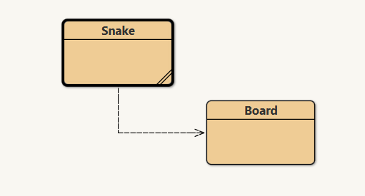

# Evaluasi Akhir Semester PBO G
Nama: Kaylan Fairuza Aqila

NRP: 5025231092

## Soal

1. Apa yang dimaksud dengan Inheritance dalam Java. Bagaimana implementasi inheritance dalam Final Project yang sedang dikerjakan.

2. Jelaskan fitur Aplikasi yang ada dalam Final Project

3. Buatlah desain Diagram Kelas dari aplikasi Final Project

4. Implementasikan Aplikasi yang telah didesain dengan menggunakan Pemrograman Berbasis Obyek Java

5. Buat PPT presentasi yang menunjang Demo Aplikasi

6. Demokan aplikasi dengan membuat video dan diupload di Youtube.

## Jawaban
1. _Inheritance_ adalah proses pewarisan atribut dan method dari kelas induk oleh kelas turunan. Tujuan dari _inheritance_ adalah pengefisienan kode/mencegah penulisan kode yang berulang untuk satu kelas yang mirip dengan kelas lainnya. 

    Dalam Snake Game, _inheritance_ dapat dilihat pada class `Snake` dari class `JFrame` dalam library Java Swing serta pada class `Board` dari class `JPanel` dalam library Java Swing.

    ```JAVA
    public class Snake extends JFrame {
        ...
    }

    public class Board extends JPanel implements ActionListener {
        ...
    }
    ```

2. Snake adalah permainan arkade klasik yang memiliki mekanika permainan yang sangat sederhana. Fitur yang disediakan antara lain:

    - Permainan disajikan melalui sebuah _window_ kecil yang dapat berpindah tempat.
    - Permainan disajikan melalui grafik pixel serta tema warna seperti permainan arkade klasik.
    - Permainan memberikan tantangan melalui modifikasi dari mekanika permainan Snake klasik dengan menambahkan penghalang di tengah papan permainan.

3. Karena adanya penggunaan library Java Swing, desain diagram kelas hanya terdiri dari dua class yaitu `Snake` dan `Board`. Desain diagram kelas adalah sebagai berikut:

    

4. Implementasi Snake Game dapat dilihat [disini](/EAS/snake-game/).

    - class `Snake`
        ```java
        import java.awt.EventQueue;
        import javax.swing.JFrame;

        public class Snake extends JFrame {

            public Snake() {
                
                initUI();
            }
            
            private void initUI() {
                
                add(new Board());
                    
                setResizable(false);
                pack();
                
                setTitle("Snake");
                setLocationRelativeTo(null);
                setDefaultCloseOperation(JFrame.EXIT_ON_CLOSE);
            }
            

            public static void main(String[] args) {
                
                EventQueue.invokeLater(() -> {
                    JFrame ex = new Snake();
                    ex.setVisible(true);
                });
            }
        }
        ```
    - class `Board`
        ```java
        import java.awt.Color;
        import java.awt.Dimension;
        import java.awt.Font;
        import java.awt.FontMetrics;
        import java.awt.Graphics;
        import java.awt.Image;
        import java.awt.Toolkit;
        import java.awt.event.ActionEvent;
        import java.awt.event.ActionListener;
        import java.awt.event.KeyAdapter;
        import java.awt.event.KeyEvent;
        import javax.swing.ImageIcon;
        import javax.swing.JPanel;
        import javax.swing.Timer;

        public class Board extends JPanel implements ActionListener {

            private final int B_WIDTH = 300;
            private final int B_HEIGHT = 300;
            private final int DOT_SIZE = 10;
            private final int ALL_DOTS = 900;
            private final int RAND_POS = 29;
            private final int DELAY = 140;

            private final int x[] = new int[ALL_DOTS];
            private final int y[] = new int[ALL_DOTS];

            private int dots;
            private int apple_x;
            private int apple_y;

            private boolean leftDirection = false;
            private boolean rightDirection = true;
            private boolean upDirection = false;
            private boolean downDirection = false;
            private boolean inGame = true;

            private Timer timer;
            private Image ball;
            private Image apple;
            private Image head;

            // Daftar koordinat tembok
            private final int[][] walls = {
                {100, 60, 10, 10},
                {100, 70, 10, 10},
                {140, 100, 10, 10},
                {120, 120, 40, 10},
                {50, 50, 10, 10},
                {60, 50, 10, 10},
                {70, 50, 10, 10},
                {200, 200, 10, 10},
                {210, 200, 10, 10},
                {220, 200, 10, 10},
                {150, 150, 10, 10}
            };

            public Board() {
                initBoard();
            }

            private void initBoard() {
                addKeyListener(new TAdapter());
                setBackground(Color.black);
                setFocusable(true);
                setPreferredSize(new Dimension(B_WIDTH, B_HEIGHT));
                loadImages();
                initGame();
            }

            private void loadImages() {
                ImageIcon iid = new ImageIcon("src/resources/dot.png");
                ball = iid.getImage();

                ImageIcon iia = new ImageIcon("src/resources/apple.png");
                apple = iia.getImage();

                ImageIcon iih = new ImageIcon("src/resources/head.png");
                head = iih.getImage();
            }

            private void initGame() {
                dots = 3;

                boolean validStart = false;
                while (!validStart) {
                    x[0] = (int) (Math.random() * RAND_POS) * DOT_SIZE;
                    y[0] = (int) (Math.random() * RAND_POS) * DOT_SIZE;

                    validStart = true;
                    for (int[] wall : walls) {
                        if (x[0] >= wall[0] && x[0] < wall[0] + wall[2] && y[0] >= wall[1] && y[0] < wall[1] + wall[3]) {
                            validStart = false;
                            break;
                        }
                    }
                }

                for (int z = 1; z < dots; z++) {
                    x[z] = x[0] - z * DOT_SIZE;
                    y[z] = y[0];
                }

                locateApple();

                timer = new Timer(DELAY, this);
                timer.start();
            }

            @Override
            public void paintComponent(Graphics g) {
                super.paintComponent(g);
                doDrawing(g);
            }

            private void doDrawing(Graphics g) {
                if (inGame) {
                    g.drawImage(apple, apple_x, apple_y, this);

                    for (int z = 0; z < dots; z++) {
                        if (z == 0) {
                            g.drawImage(head, x[z], y[z], this);
                        } else {
                            g.drawImage(ball, x[z], y[z], this);
                        }
                    }

                    g.setColor(Color.blue);

                    // Gambar semua tembok
                    for (int[] wall : walls) {
                        g.fillRect(wall[0], wall[1], wall[2], wall[3]);
                    }

                    Toolkit.getDefaultToolkit().sync();
                } else {
                    gameOver(g);
                }
            }

            private void gameOver(Graphics g) {
                String msg = "Game Over";
                Font small = new Font("Helvetica", Font.BOLD, 14);
                FontMetrics metr = getFontMetrics(small);

                g.setColor(Color.white);
                g.setFont(small);
                g.drawString(msg, (B_WIDTH - metr.stringWidth(msg)) / 2, B_HEIGHT / 2);
            }

            private void increaseSpeed() {
                if (dots % 5 == 0) {
                    if (DELAY > 50) {
                        timer.setDelay(DELAY - 10);
                    }
                }
            }

            private void checkApple() {
                if ((x[0] == apple_x) && (y[0] == apple_y)) {
                    dots++;
                    locateApple();
                    increaseSpeed();
                }
            }

            private void move() {
                for (int z = dots; z > 0; z--) {
                    x[z] = x[(z - 1)];
                    y[z] = y[(z - 1)];
                }

                if (leftDirection) {
                    x[0] -= DOT_SIZE;
                }

                if (rightDirection) {
                    x[0] += DOT_SIZE;
                }

                if (upDirection) {
                    y[0] -= DOT_SIZE;
                }

                if (downDirection) {
                    y[0] += DOT_SIZE;
                }
            }

            private void checkCollision() {
                // Cek tabrakan dengan tubuh ular
                for (int z = dots; z > 0; z--) {
                    if ((z > 4) && (x[0] == x[z]) && (y[0] == y[z])) {
                        inGame = false;
                    }
                }

                // Cek tabrakan dengan dinding bawah, atas, kiri, dan kanan
                if (y[0] >= B_HEIGHT || y[0] < 0 || x[0] >= B_WIDTH || x[0] < 0) {
                    inGame = false;
                }

                // Cek tabrakan dengan tembok
                for (int[] wall : walls) {
                    if (x[0] >= wall[0] && x[0] < wall[0] + wall[2] && y[0] >= wall[1] && y[0] < wall[1] + wall[3]) {
                        inGame = false;
                    }
                }

                if (!inGame) {
                    timer.stop();
                }
            }

            private void locateApple() {
                int r = (int) (Math.random() * RAND_POS);
                apple_x = ((r * DOT_SIZE));

                r = (int) (Math.random() * RAND_POS);
                apple_y = ((r * DOT_SIZE));
            }

            @Override
            public void actionPerformed(ActionEvent e) {
                if (inGame) {
                    checkApple();
                    checkCollision();
                    move();
                }
                repaint();
            }

            private class TAdapter extends KeyAdapter {
                @Override
                public void keyPressed(KeyEvent e) {
                    int key = e.getKeyCode();

                    if ((key == KeyEvent.VK_LEFT) && (!rightDirection)) {
                        leftDirection = true;
                        upDirection = false;
                        downDirection = false;
                    }

                    if ((key == KeyEvent.VK_RIGHT) && (!leftDirection)) {
                        rightDirection = true;
                        upDirection = false;
                        downDirection = false;
                    }

                    if ((key == KeyEvent.VK_UP) && (!downDirection)) {
                        upDirection = true;
                        rightDirection = false;
                        leftDirection = false;
                    }

                    if ((key == KeyEvent.VK_DOWN) && (!upDirection)) {
                        downDirection = true;
                        rightDirection = false;
                        leftDirection = false;
                    }
                }
            }
        }
        ```

5. PPT presentasi dapat dilihat [disini](https://drive.google.com/file/d/1HXAgUEDUrIcrkcFe7ctBcgfRc6qsSBCV/view?usp=sharing).

6. Demo aplikasi dapat dilihat [disini](https://www.youtube.com/@kaylanfairuza9819) (menyusul)